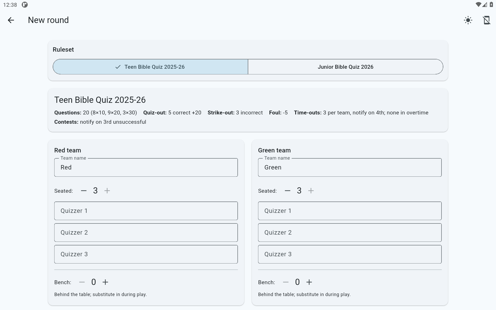
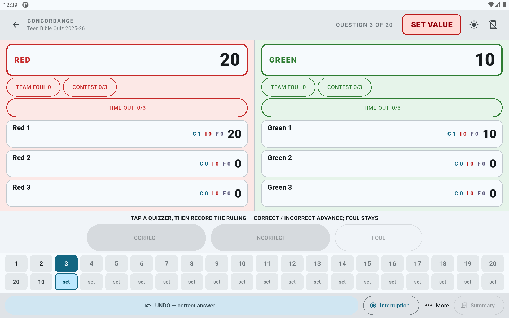
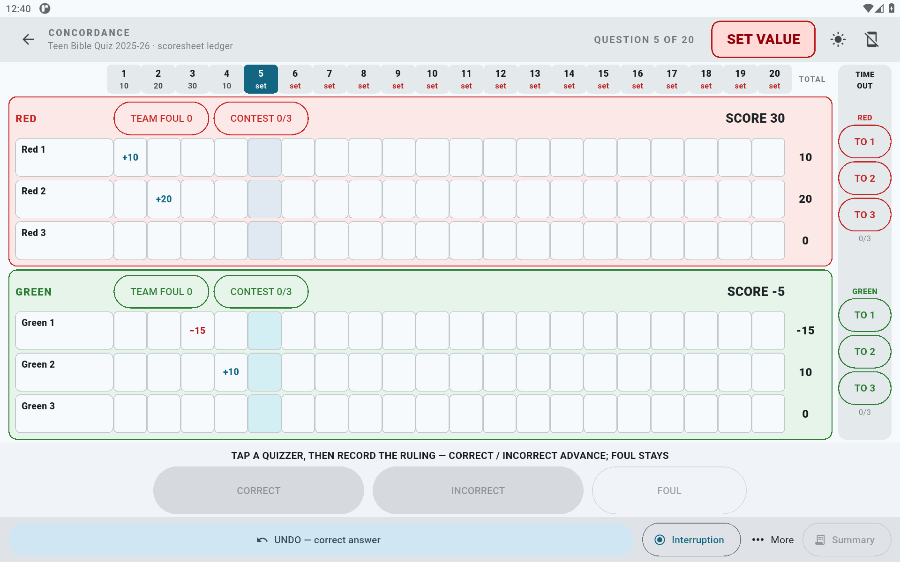
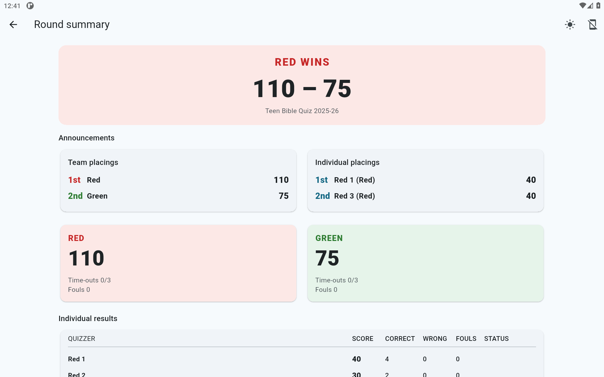

# Concordance

An offline, touch-first **scorekeeper for Bible Quiz matches** — a clean,
modern replacement for the official app, built to be intuitive and usable
within seconds of picking it up.

Concordance runs **one round** of scoring on a tablet, completely offline, 
with built-in presets for the Assemblies of God **Teen Bible Quiz (TBQ)** 
and **Junior Bible Quiz (JBQ)** rulebooks.

Currently working and tested on: Android / Fire tablet · Windows · Linux · macOS

## Contents

- [What is this?](#what-is-this)
- [Screenshots](#screenshots)
- [Features](#features)
- [Install](#install)
- [Quick start](#quick-start)
- [Configuring rulesets](#configuring-rulesets)
- [Development](#development)
- [Contributing](#contributing)
- [Bug Reports/Feature Requests](#bug-reportsfeature-requests)
- [License](#license)
- [Acknowledgements](#acknowledgements)

## What is this?

A **Bible Quiz match** has two teams of quizzers seated at a quiz box. The
quizmaster reads questions of varying point values; quizzers buzz in and answer.
Points are awarded for correct answers and deducted for incorrect ones, and
individual quizzers can "quiz out," "strike out," or "foul out." Somebody has to
keep score — accurately, live, and fast.

That somebody is usually a volunteer, and the existing digital tools are clunky
enough that most people wish they just had the familiar paper scoresheet instead.
Concordance is built for that person: **big buttons, one-tap scoring, an obvious undo**,
and everything the paper scoresheet records (interruptions, contests, time-outs, fouls)
captured digitally. It's designed to be handed off to a volunteer scorekeeper
and used without any training, making scorekeeping **easier**, not harder.

The app never makes a sound, works with no internet, and saves every entry,
so a tablet crash, dead battery, or Wi-Fi outage mid-match will never
lose the game.

## Screenshots

| Setup | Live scoring — Modern | Live scoring — Classic | Summary |
| :-: | :-: | :-: | :-: |
|  |  |  |  |

## Features

- **One-tap scoring** — large (≥48dp) targets, no hidden gestures, a prominent
  undo for every mis-tap.
- **Two live-scoring views** — *Modern* (a split-field layout) and *Classic* (a
  recognizable scoresheet ledger). Pick per device or per round.
- **Automatic alerts** — quiz-out, strike-out, and foul-out notify you so you
   never have to track them manually.
- **Rulesets for everyone** — TBQ and JBQ ship as built-in presets.
- **Autosave & resume** — every action is written to disk immediately; a round
  survives an app kill or reboot, mid-match.
- **PDF/CSV export** — a readable round summary you can save or share.
- **Offline & silent** — no network, no accounts, no telemetry; the app plays no
  audio (haptics are opt-in and off by default), so it never distracts a match.
- **Light and dark mode** — follows the system theme; light red/green tints keep the
  two teams distinguishable at a glance regardless.

## Install

### Android / Fire tablet (recommended)

The recommended device is an **Amazon Fire HD 10**, which has **no Google Play
services** — so Concordance ships as a sideloaded, GMS-free APK.

1. Download the latest `app-release.apk` from the project [Releases](https://github.com/JosiahL06/Concordance/releases) page.
2. On the tablet, enable **Settings → Security → Apps from Unknown Sources**
   (or *Install unknown apps* for your file manager).
3. Open the downloaded APK and install.

### Windows · Linux · macOS

Download the matching build from the [Releases](https://github.com/JosiahL06/Concordance/releases)
page (Windows `.zip`, Linux
`tar.gz`, macOS zip folder). These desktop builds are currently **unsigned**, so
Windows and macOS will show a trust warning on first launch — right-click →
*Open* on macOS, and *More info → Run anyway* on Windows. Signed and verified
builds are planned for a future release.

## Quick start

1. **Start a new round.** On the home screen, tap **Start a new round**.
2. **Pick a ruleset.** Choose the **TBQ** or **JBQ** tab; the details card shows
   the question count, point values, and quiz/strike/foul-out limits.
3. **Set up teams & quizzers.** Enter team names (default Red/Green) and name
   each seated and bench quizzer. Choose **Modern** or **Classic** live view.
4. **Keep score.** As each question is read, set its point value, then tap
   **Correct** or **Incorrect** for the answering quizzer. Fouls, time-outs,
   interruptions, and contests have their own buttons. Made a mistake? Tap
   **Undo**.
5. **Finish & export.** The end-of-round **Summary** shows final scores and
   announcements; export it as **PDF** or **CSV** to save or share if you like.

You can leave a round at any time — it's saved automatically and appears under
**Resume round** on the home screen.

## Configuring rulesets

Everything that varies between rulebooks — question count and point values,
correct/incorrect multipliers, quiz-out thresholds and bonuses, notification limits
— lives in the ruleset config files.
TBQ and JBQ rulesets for 2026 ship as built-in presets:

```
assets/rulesets/tbq-25-26.json
assets/rulesets/jbq-2026.json
```

Future rulesets will be added as they are released; previous rulesets will never be deleted.

To support a custom ruleset, add a new JSON file — **no code changes**.
The full schema and the decisions behind it are documented in
[`docs/ruleset-schema.md`](docs/ruleset-schema.md).

## Development

Built with [Flutter](https://flutter.dev) (stable); see
[CONTRIBUTING.md](CONTRIBUTING.md) for the full toolchain, build, test, and
release-signing details.

## Contributing

Concordance is still in active development so contributions are welcome! Please read
[CONTRIBUTING.md](CONTRIBUTING.md) for the development environment, testing standard,
and release process.

## Bug Reports/Feature Requests
Encountered a bug or an issue? Have a recommendation or request for a new feature?
Open an [issue](https://github.com/JosiahL06/Concordance/issues/new) in the Github repository.

## License

[GNU Affero General Public License v3.0](LICENSE).

## Acknowledgements

- The scoring rules encoded in the built-in presets are derived from the
  Assemblies of God **Teen Bible Quiz** and **Junior Bible Quiz** rulebooks,
  © My Healthy Church.
